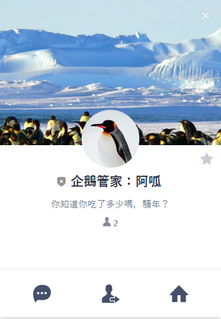

<h1>Line chatbot - 企鵝管家</h1>

<h2>Description:</h2>

My first time building a line chatbot, encountered tons of problems. I would like to note them down for learning purpose, with more detailed description in my Medium articles, if I did write one about it.

And yes we'll get back to how to set up this App soon, no worry.

<h3>Here are (some of) the problems I tried to tackle:</h3>
<ol>
  <li>Line official account manager: how to create a account, basic setting, documentation, and blablabla...</li>
  <li>Line bot layout: what does a line bot look like?</li>
  <li>MySQL: I learned some MySQL syntax and connection pool problem because Heroku won't support MongoDB soon.</li>
  <li>JS Callback: I revised and learned a lot more about the Asynchronous JavaScript, like callback, Promise, and Await/Async.
  </li>
</ol>
